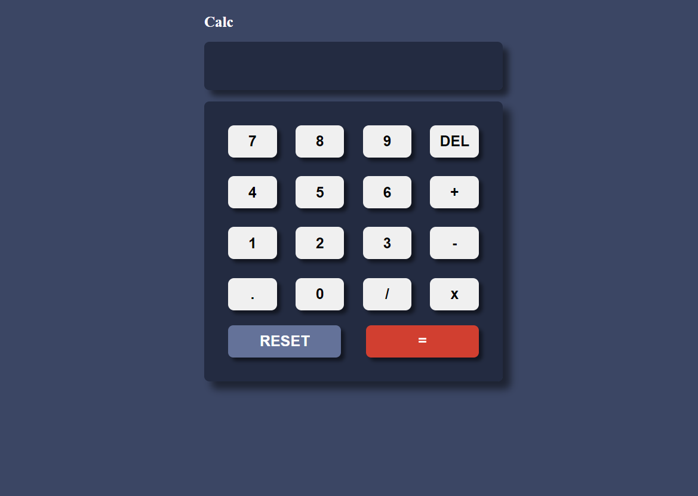

# Calculator Website

A simple calculator website built using HTML, CSS, and JavaScript.



## Features

- Basic arithmetic calculations: addition, subtraction, multiplication, and division.
- Clear button to reset the input.
- Delete button to remove the last entered character.
- Keyboard support for entering numbers and operators.

## Getting Started

### Prerequisites

You need a web browser to run this website.

### Installation

1. Clone the repository:

   ```
   git clone https://github.com/sukomal07/calculator.git
   ```

2. Navigate to the project directory:

   ```
   cd calculator
   ```

3. Open `index.html` in your web browser.

## How to Use

1. Click on the number buttons to enter digits for your calculation.
2. Click on the operator buttons (+, -, \*, /) to select the operation.
3. You can use the decimal point (.) button to input decimal numbers.
4. Press the "DEL" button to delete the last entered character.
5. Press the "RESET" button to clear the input.
6. Click the "=" button or press Enter to see the calculated result.

## Keyboard Shortcuts

- Digits 0-9: Type the corresponding keys on your keyboard.
- Operators (+, -, _, /): Use the +, -, _, and / keys.
- Decimal point (.): Use the . key.
- Delete: Use the Backspace key.
- Reset: Use the Esc key.
- Calculate: Use the Enter key.

## Limitations

- The calculator currently supports basic arithmetic calculations and does not include advanced functions (e.g., square root, exponentiation).
- Division by zero will display an error message.
- The calculator may not handle extremely large or small numbers gracefully.

## Contributing

Contributions are welcome! If you find any issues or have suggestions for improvements, feel free to open an issue or submit a pull request.
